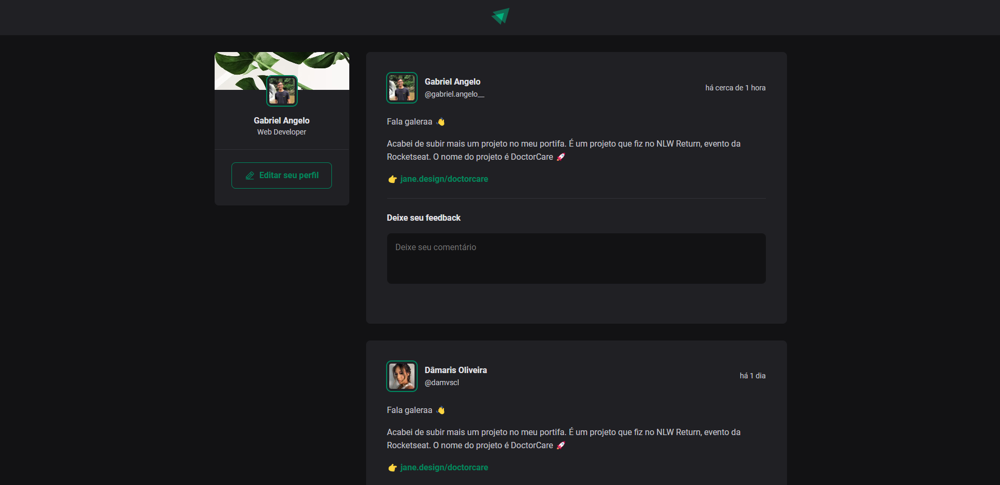
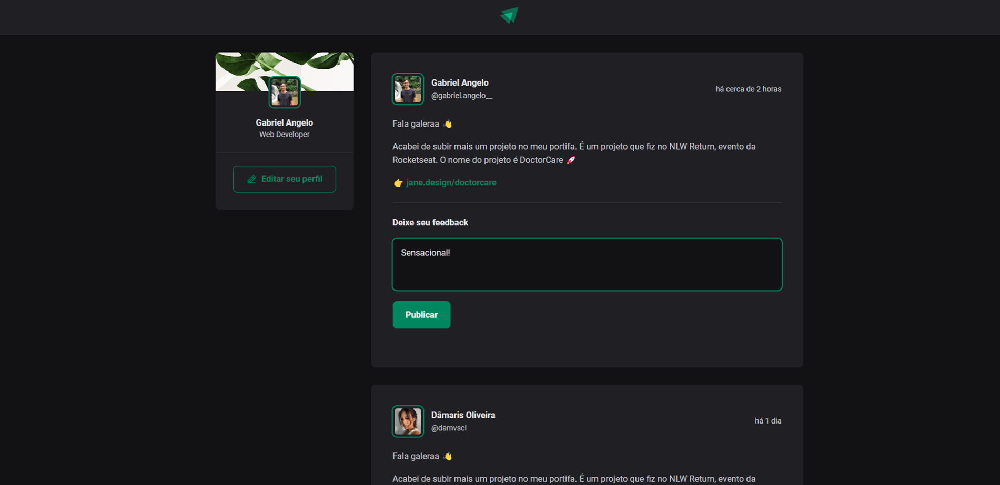
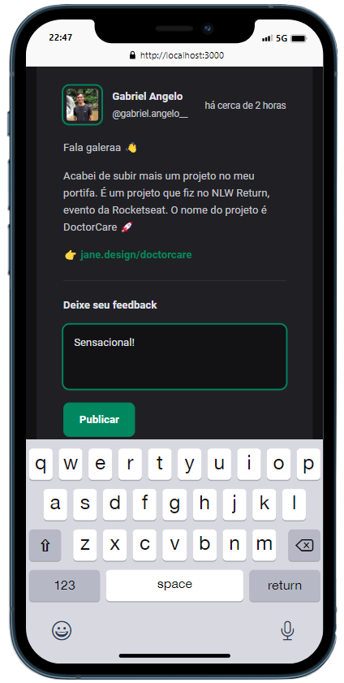
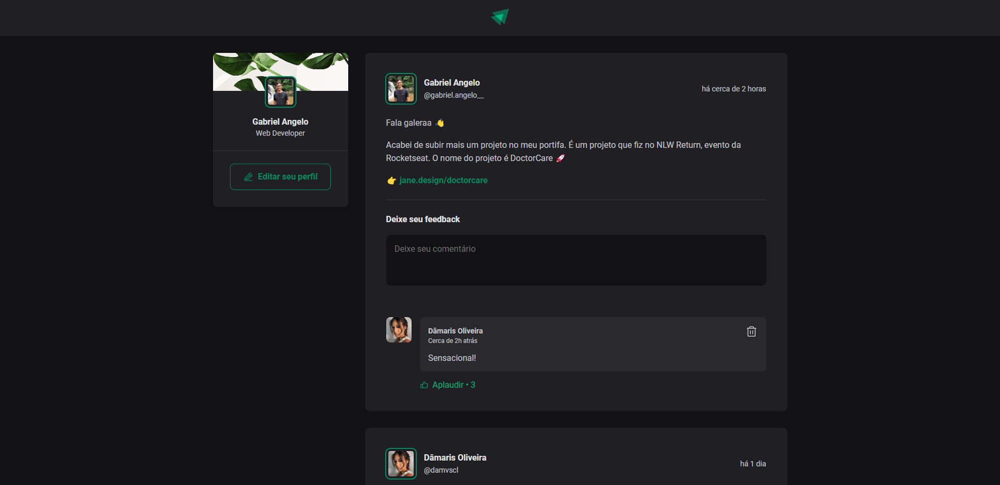

# Bem vindo ao projeto de blog

Confira algumas imagens e funcionalidades desse projeto:

## Pagina inicial com a listagem de Posts e comentários

Como podemos observar, uma página simples e moderna com várias funcionalidades, como:

 - Data de publicação (com tempo decorrido dinâmico)

 - Dados dinâmicos consumindo dados da própria API do github

## Área de comentários inteligente com alguns sistemas de segurança

Sistemas simples como: 

 - Verificar campo vazio,

 - Se não houver <b>foco</b> na textarea, o botão Publicar não irá ser exibido em tela

## Possibilidade de "Aplaudir" ou excluir o comentário selecionado.

E sistema de aplaudir comentário ou até excluí-lo dinamicamente.
